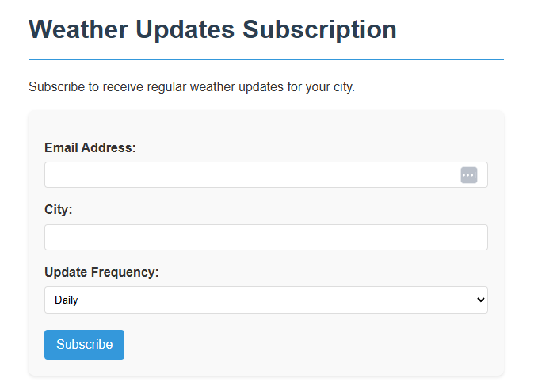

# 🌦️ Weather Subscription API

A simple API service that lets users **subscribe** to daily weather updates for a specific **city** via **email**. Stay informed with the latest weather forecasts delivered to your inbox!

---

## 📌 Features

- 📬 Subscribe to daily weather emails
- 🏙️ Choose any city worldwide
- ✅ Email verification (check your spam folder!)
- ❌ Unsubscribe easily at any time

---

### 1. 📥 Subscribe to Weather Updates

**Link:** `https://golang-se-project-production.up.railway.app/`

---

## 2. 📧 Verify Your Email

After subscribing, you will receive an email with a verification link.

👉 **Please check your inbox or spam folder** and click the verification link to confirm your subscription.

Once your email is verified, you will start receiving **daily weather updates** for the city you selected.

---

## 3. ❌ Unsubscribe

If you no longer wish to receive weather updates, you can unsubscribe at any time.
Using link in email for unsubscribing

